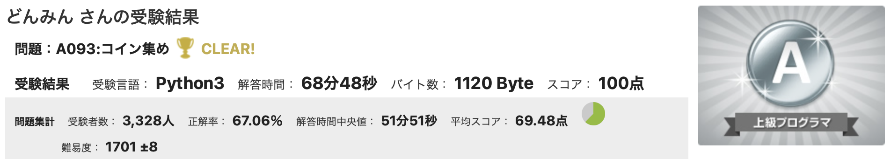
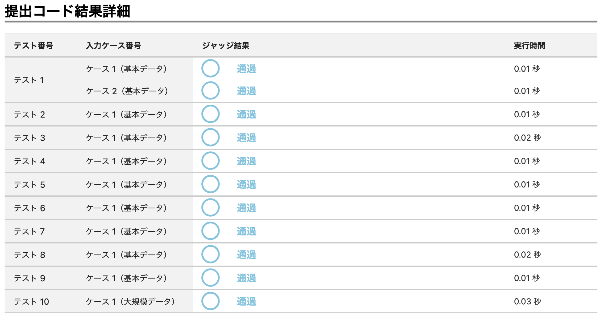

# **AtCoder solutions**
### アルゴリズムの学習と成長の記録
複雑な問題をより効率的なコードで解決する能力を身につけるための努力の記録です。 
[**AtCoder**](https://atcoder.jp)が開催する**AtCoder Beginner Contest(以下ABC)**の問題を中心に解いています。
- **難易度** : 各問題はアルファベット順に難易度が上がる構成（A < B < C...）です。
- **構成** : コンテストごとにフォルダを分けて管理しています。
- **内容** : 提出して、AC(Accepted)を取得したコードのみを管理しています。
- **注意** : [著作権保護](https://atcoder.jp/tos)のため、問題文は記載しておりません。各問題の詳細は[**AtCoder公式サイト**](https://atcoder.jp/contests/)を参照してください。

## 🏆 主な成果
- **paiza Aランク取得** (2026/04/02)
    - 独学で習得した <b>DFS(深さ優先探索)</b>を実装し、クリアしました。
    - 
    - 

## 📈Stats (統計)
**2026/04/04 時点**
- **持続日数** : **140日**以上
- **解いた問題数** : **400問**以上
- **使用言語** : Python, C++

## 🏁 現在の目標
- **Pythonで ABC C問題を安定的に解く**
    - 現在 C問題においてアルゴリズム構想に時間がかかる。
    - どんな形式のC問題でも **平均１時間以内**に解くことが目標

## 🗓️ Daily Routine & Special Rule
- **Daily Routine (毎日のルーティン)**
    - **Python** : ABC A,B問題
    - **C++** : ABC A問題
    - **Challenge** : **Pythonで ABC C問題に毎日挑戦する**

- **Special Rule (スペシャルルール)**
    - Pythonで C問題が解けた日は、「必ずその日にC++で B問題も解く」

## ✏️ 学習の軌跡
- **2025/11/07** : リポジトリ生成
- **2025/11/07** : 初めての **Python**で **ABC A問題**クリア
- **2025/11/09** : 初めての **Python**で **ABC B問題**クリア
- **2025/11/09** : ルーティンに「**毎日PythonでABC B問題**」追加
- **2025/11/18** : 初めての <b>C++</b>で **ABC A問題**クリア
- **2025/11/18** : ルーティンに「**毎日C++でABC A問題**」追加
- **2025/11/20** : 初めての **Python**で **ABC C問題**クリア
- **2026/01/29** : 初めての <b>C++</b>で **ABC B問題**クリア